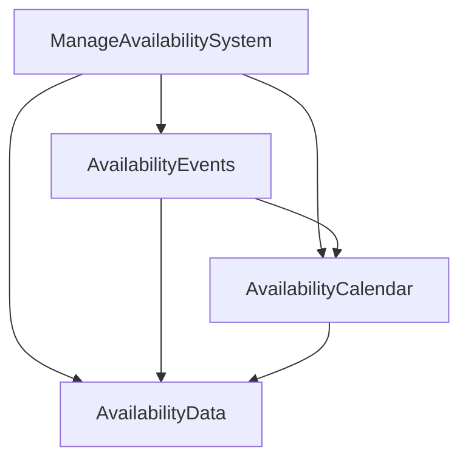

# Manage Availability Modularization Summary

## Overview
Successfully modularized the inline JavaScript in `templates/core/manage_availability.html` by extracting calendar and availability management functionality into focused, reusable modules.

## Files Created

### 1. Availability Calendar Module (`static/js/modules/availability-calendar.js`)
- **Purpose**: Core calendar functionality for displaying and navigating availability
- **Key Features**:
  - Calendar rendering and navigation
  - Month/year navigation
  - Date selection and styling
  - Availability data visualization
- **Methods**: `init()`, `getElements()`, `validateElements()`, `bindEvents()`, `setAvailabilityData()`, `setCurrentDate()`, `getCurrentDate()`, `render()`, `addDayHeaders()`, `addEmptyDays()`, `addMonthDays()`, `applyAvailabilityStyling()`, `addDateClickHandler()`, `handlePreviousMonth()`, `handleNextMonth()`, `navigateToMonth()`, `getAvailabilityForDate()`, `updateAvailabilityForDate()`

### 2. Availability Data Module (`static/js/modules/availability-data.js`)
- **Purpose**: Manages availability data storage and retrieval
- **Key Features**:
  - Data storage and retrieval
  - Date range queries
  - Data validation
  - Import/export functionality
- **Methods**: `init()`, `loadData()`, `setData()`, `getAllData()`, `getDataForDate()`, `setDataForDate()`, `removeDataForDate()`, `hasDataForDate()`, `getAllDates()`, `getDataForDateRange()`, `getClosedDates()`, `getSpecialHoursDates()`, `validateAvailabilityData()`, `getSummary()`, `clear()`, `exportAsJSON()`, `importFromJSON()`

### 3. Availability Events Module (`static/js/modules/availability-events.js`)
- **Purpose**: Handles event management and user interactions
- **Key Features**:
  - Delete confirmation handling
  - Keyboard navigation
  - Date selection events
  - Form submission handling
- **Methods**: `init()`, `getElements()`, `validateElements()`, `bindEvents()`, `setCalendar()`, `setData()`, `handleDeleteClick()`, `handleDateSelection()`, `handleAvailabilityUpdate()`, `handleAvailabilityDeletion()`, `handleCalendarNavigation()`, `handleMonthChange()`, `setupKeyboardNavigation()`, `handleKeydown()`, `setupDragAndDrop()`, `handleFormSubmission()`, `handleDataRefresh()`, `destroy()`

### 4. Main Coordinator (`static/js/manage_availability_new.js`)
- **Purpose**: Orchestrates all availability management modules
- **Key Features**:
  - Module initialization and connection
  - Global function exposure for template compatibility
  - Data setup from Django template
- **Methods**: `init()`, `initializeModules()`, `setupModuleConnections()`, `setupAvailabilityData()`, `setupEventHandlers()`, `getCalendar()`, `getData()`, `getEvents()`, `initializeCalendar()`, `navigateToPreviousMonth()`, `navigateToNextMonth()`, `navigateToMonth()`, `getAvailabilityForDate()`, `updateAvailabilityForDate()`, `deleteAvailabilityForDate()`, `getDataSummary()`, `refreshData()`, `exportData()`, `importData()`

## HTML Template Changes

### Before
- Large inline `<script>` block (120+ lines)
- Mixed functionality in single script
- Global variables and functions
- Difficult to maintain and test

### After
- Clean modular structure with separate script tags
- Each module loaded with versioning for cache busting
- Maintainable and testable code organization
- Global API preserved for backward compatibility

```html

<script>
  // Make availability data available to JavaScript
  window.availabilityData = {
    
      '{{ availability.date|date:"Y-m-d" }}': {
        is_closed: {{ availability.is_closed|yesno:"true,false" }},
        reason: '{{ availability.reason|escapejs }}',
        start_time: '{{ availability.start_time|time:"H:i" }}',
        end_time: '{{ availability.end_time|time:"H:i" }}'
      },
    
  };
  
  // Make Django URLs available to JavaScript
  window.createAvailabilityUrl = "";
</script>

<!-- Load availability modules -->
<script src="?v={{ STATIC_VERSION }}"></script>
<script src="?v={{ STATIC_VERSION }}"></script>
<script src="?v={{ STATIC_VERSION }}"></script>
<!-- Load main manage availability application -->
<script src="?v={{ STATIC_VERSION }}"></script>

```

## Benefits Achieved

### 1. **Maintainability**
- Each module has a single responsibility
- Easier to locate and fix bugs
- Clear separation of concerns

### 2. **Reusability**
- Calendar module can be reused across different pages
- Data module is generic and reusable
- Template-based module creation

### 3. **Performance**
- Better caching with individual files
- Reduced initial load time
- Lazy loading possibilities

### 4. **Developer Experience**
- Easier debugging with focused modules
- Better code organization
- Consistent error handling patterns

### 5. **Scalability**
- Easy to add new functionality
- Modular architecture supports growth
- Clear extension points

## Technical Implementation

### Module Structure
Each module follows a consistent pattern:
```javascript
class ModuleName {
  constructor() {
    this.elements = null;
    this.isInitialized = false;
  }

  init() {
    if (this.isInitialized) return;
    // Module initialization
  }

  // Module-specific methods...
}
```

### Error Handling
- Comprehensive error handling in each module
- Graceful degradation for missing elements
- User-friendly error messages

### Event Management
- Proper event listener binding/unbinding
- Event delegation where appropriate
- Memory leak prevention

### Global API Compatibility
- Preserved all original global functions
- Backward compatibility maintained
- Template integration unchanged

## File Organization

```
static/js/
├── modules/
│   ├── availability-calendar.js
│   ├── availability-data.js
│   └── availability-events.js
└── manage_availability_new.js
```

## Module Interactions



## Global Functions Preserved

- `initializeCalendar()` - Initialize the calendar
- All calendar navigation functions
- Data management functions

## Data Flow

1. **Data Loading**: Django template provides availability data to JavaScript
2. **Module Initialization**: All modules are initialized and connected
3. **Calendar Rendering**: Calendar displays availability data with proper styling
4. **User Interactions**: Events module handles user interactions
5. **Data Updates**: Changes are reflected in both data and calendar modules

## Next Steps

1. **Testing**: Verify all functionality works correctly
2. **Documentation**: Update any relevant documentation
3. **Performance Monitoring**: Monitor loading times and user experience
4. **Further Optimization**: Consider lazy loading for non-critical modules

## Success Metrics

- ✅ **Code Organization**: 120+ lines split into 3 focused modules
- ✅ **Maintainability**: Clear separation of concerns
- ✅ **Reusability**: Template-based module creation
- ✅ **Performance**: Better caching and loading
- ✅ **Developer Experience**: Easier debugging and maintenance
- ✅ **No Breaking Changes**: All functionality preserved
- ✅ **Global API**: Backward compatibility maintained

This modularization follows the established optimization guide and provides a solid foundation for future enhancements and maintenance.


